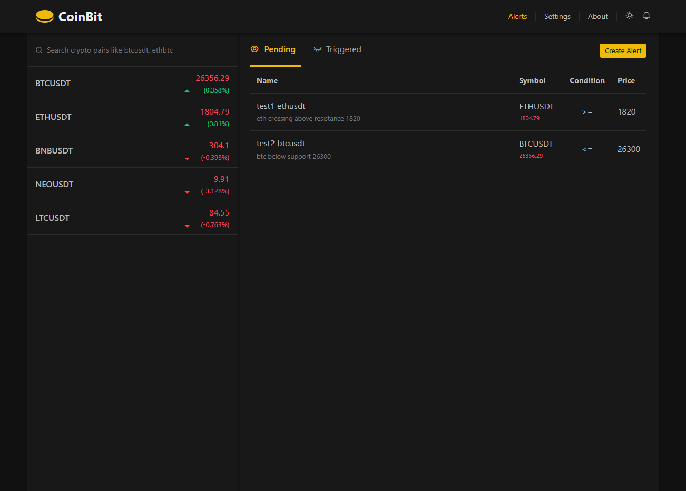

# CoinBit App

Get real-time cryptocurrency data updates and customized price alerts with CoinBit App. Built using Vanilla JavaScript and the Binance websocket API, this app is the ultimate tool for traders looking to stay ahead of the game.

## Features

- Real-time cryptocurrency data updates from the Binance WebSocket API.
- Create a custom watchlist to monitor your favorite cryptocurrencies.
- Set custom price alerts with options to send notifications to Discord.
- Responsive design for seamless usage on mobile, tablet, and desktop devices.
- Dark and light mode options for personalized user preference.

## Technologies Used

- HTML, CSS (SCSS), and Vanilla JavaScript.
- Hosted on Cloudflare Pages for easy deployment.
- Utilizes the MVC (Model-View-Controller) architecture pattern for a structured codebase.
- Binance WebSocket API for real-time cryptocurrency data.
- Discord Webhook API for sending price alerts to Discord.

## Disclaimer

- **No user data stored:** This app does not store any user data on the server. User preferences and settings are stored in the browser's local storage.
- **For demonstration purposes:** CoinBit is intended for demonstration purposes only and should not be used for actual trading. We are not liable for any losses incurred through the use of this app.

## Getting Started

To run the CoinBit app locally, follow these steps:

1. Clone the repository: `git clone https://github.com/aashutoosh/CoinBit-App.git`
2. Navigate to the project directory: `cd CoinBit-App`
3. Compile SCSS styles:

- Ensure you have the Watch Sass extension installed in Visual Studio Code.
- Open the `./src/scss/main.scss` file in Visual Studio Code.
- In the bottom-right corner, click on "Watch Sass" to start the SCSS compilation process.
- The compiled CSS file (`./src/css/main.css`) will be automatically generated and updated whenever you save changes to the SCSS file.

4. Open the `index.html` file in your preferred web browser.

## Contributing

Contributions are welcome! If you have bug fixes, feature suggestions, or improvements, please follow these steps:

1. Fork the repository.
2. Clone the project to your machine.
3. Create a new branch: `git checkout -b feature/your-feature`
4. Make your changes and commit them: `git commit -m 'Add some feature'`
5. Push your changes to the branch: `git push origin feature/your-feature`
6. Open a pull request on GitHub, explaining your changes and their benefits.

Please ensure that your code follows the project's coding style and conventions.

## Support

For any questions, issues, or support requests, please open an issue on our GitHub Issues page.
